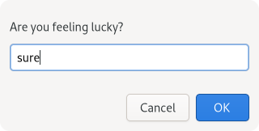

# Popup (WIP)

GUI for javascript standard popup's in [deno](https://deno.land/).

### Example

```typescript
import { prompt } from "https://deno.land/x/popup/mod.ts";

prompt("Are you feeling lucky?", "sure");
```

result will look like this:



### Overwrite Global Functions

```typescript
import { alert, confirm, prompt } from "https://deno.land/x/popup/mod.ts";

window.alert = alert;
window.prompt = prompt;
window.confirm = confirm;
```

### Dependencies

    gtk4

### TODO

- [ ] Add windows and macOS builds
